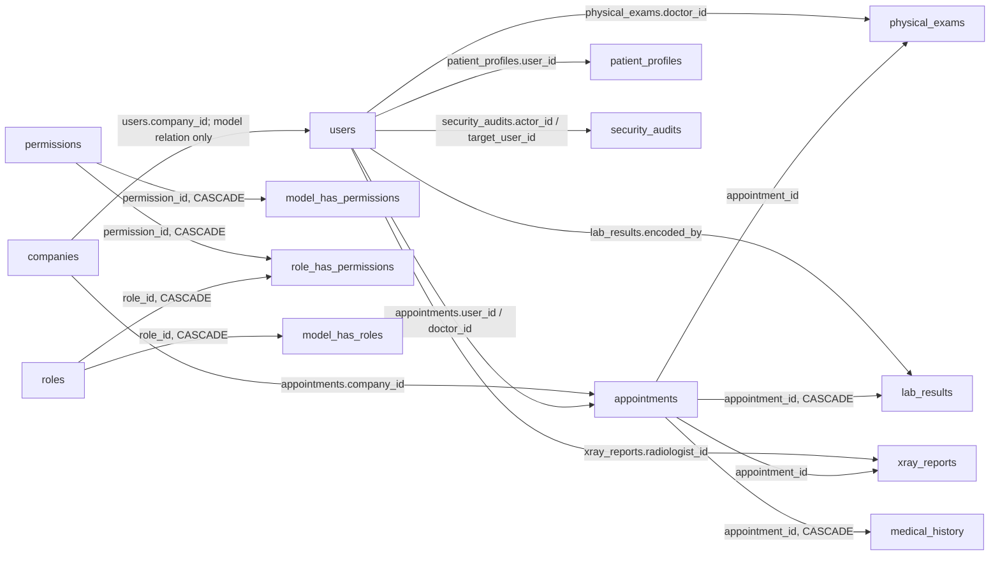

# Database Audit and Safe Cleanup Report

Audit date: 2026-07-31 (Asia/Manila)  
Application: Laravel 12 medical services management system  
Database inspected: `database/database.sqlite` (SQLite)

## Executive result

No tables were deleted, merged, or archived. The audit did not find a table that satisfied the required **zero dependency** rule. Empty tables were retained when configuration, package, migration, seeder, authentication, authorization, queue, cache, analytics, or domain-code dependencies existed.

The database passed `PRAGMA integrity_check` (`ok`) and `PRAGMA foreign_key_check` (zero violations). It contains 24 tables, no database views, and no triggers.

A byte-for-byte backup was created before considering schema changes:

- File: `database/backups/database-20260731-220500.sqlite`
- Size: 356,352 bytes
- Source and backup SHA-256: `C8BEEE6A3E46ACB7992E66699AF1C4973348DEA9E6F7A27DA1BA1E17ABB91F5E`

Because nothing qualified for deletion, no drop/rollback migration and no related dead-code removal were appropriate.

## Scope and method

The audit covered migrations; models and relationships; controllers; services; repositories; middleware; web/API/console routes; React/TypeScript and Blade files; requests; seeders; the factory; mail/notifications; tests; runtime database/cache/session/queue configuration; raw query patterns; indexes; foreign keys; and SQLite metadata for stored views and triggers. There are no application policies, observers, event listeners, custom queue jobs, or custom scheduled jobs in the repository. No stored procedures are supported by or present in this SQLite database.

Code references were checked both by table/configuration name and by corresponding Eloquent model. “Frontend” below means a direct component dependency or an indirect dependency through a controller/service payload used by that component.

## Architecture and dependency graph

Important: `users.company_id` is used by `User::company()` and `Company::users()` but has no database foreign-key constraint. The Spatie model pivots are polymorphic, so their `model_id` intentionally has no conventional foreign key to `users`.

## Table-by-table disposition

| Table | Rows | Current purpose and principal references | Model / controller / route / frontend use | FK dependency | Risk | Recommendation |
|---|---:|---|---|---|---|---|
| `users` | 6 | Authentication, staff, patients, company representatives, availability, 2FA | `User`; Fortify actions; staff, company, appointment, settings and dashboard controllers; auth/settings/domain routes; many auth/admin/patient components | Parent of appointments, profiles, exams, results, X-rays and audits | High | Keep |
| `companies` | 1 | Partner companies and representatives | `Company`; `CompanyController`, `CompanyDashboardController`, imports and appointments; admin/company/appointment routes and pages | Parent of appointments; logical parent of users | High | Keep |
| `appointments` | 4 | Core booking and clinical workflow | `Appointment`; appointment and all clinical/dashboard controllers; patient/staff/admin/clinical routes and pages | Child of users/companies; parent of all examination tables | High | Keep |
| `patient_profiles` | 1 | Patient demographics | `PatientProfile`; registration/profile/import/appointment flows; appointment/admin/medtech pages | Child of users | High | Keep |
| `physical_exams` | 2 | Vital signs, findings and final classification | `PhysicalExam`; `PhysicalExamController`, dashboards; doctor exam/final-evaluation routes and pages | Child of appointments/users | High | Keep |
| `medical_history` | 4 | History captured during examination | `MedicalHistory`; `PhysicalExamController`, `AppointmentController`; doctor clinical pages | Child of appointments (cascade) | High | Keep |
| `lab_results` | 2 | Laboratory examination results | `LabResult`; `LaboratoryController`, admin dashboard; medtech routes/pages | Child of appointments (cascade) and users | High | Keep |
| `xray_reports` | 2 | X-ray findings and impressions | `XrayReport`; `XrayController`, admin dashboard; radtech routes/pages | Child of appointments/users | High | Keep |
| `security_audits` | 6 | Staff credential, import and security audit trail | `SecurityAudit`; staff, company/import and temporary-password controllers; onboarding tests | Nullable child of users (`SET NULL`) | High | Keep |
| `disease_case_records` | 0 | Historical disease data for trend/forecasting | `DiseaseCaseRecord`, `DiseaseCaseRepository`, `ForecastService`, `DiseaseForecastDashboardService`, `ForecastController`; admin forecast API/pages | None | High | Keep; empty is valid initial state |
| `patient_visit_records` | 60 | Monthly patient-volume forecasting/demo history | `PatientVisitRecord`; visit forecast service/controller, demo generator/seeder/tests; admin patient-visit API/page | None | High | Keep |
| `migrations` | 30 | Laravel migration ledger | Laravel migrator and all migration commands; no frontend | None | High | Keep framework table |
| `sessions` | 6 | Authenticated HTTP sessions | `SESSION_DRIVER=database`, `config/session.php`, auth middleware/routes | Logical user reference | High | Keep framework table |
| `password_reset_tokens` | 0 | Fortify password resets | Fortify reset actions/routes/tests and `config/auth.php` | Logical user/email reference | High | Keep framework table |
| `cache` | 7 | Application and permission cache | `CACHE_STORE=database`, `config/cache.php`, package cache | None | Medium | Keep framework table |
| `cache_locks` | 0 | Atomic locks for database cache | Database cache store configuration | None | Medium | Keep framework table |
| `jobs` | 0 | Default queued-job transport | `QUEUE_CONNECTION=database`, `config/queue.php`, development worker script | None | Medium | Keep framework table |
| `job_batches` | 0 | Laravel batch metadata | Laravel queue batching infrastructure | None | Medium | Keep framework table |
| `failed_jobs` | 0 | Failed queued-job retention | Laravel failed-job provider/configuration | None | Medium | Keep framework table |
| `roles` | 0 | Spatie permission roles (parallel to current `users.role`) | Spatie config/model, permission migration, `RoleSeeder` | Parent of two pivots | Medium | Keep for now; candidate for a separately approved authorization consolidation |
| `permissions` | 0 | Spatie permissions | Spatie config/model and permission migration | Parent of two pivots | Medium | Keep for now; same consolidation decision |
| `model_has_roles` | 0 | Polymorphic model-role pivot | Spatie configuration/migration | Child of roles | Medium | Keep for now |
| `model_has_permissions` | 0 | Polymorphic direct-permission pivot | Spatie configuration/migration | Child of permissions | Medium | Keep for now |
| `role_has_permissions` | 0 | Role-permission pivot | Spatie configuration/migration | Child of roles and permissions | Medium | Keep for now |

### Retained, merged, archived, and deleted

- Retained: all 24 tables listed above.
- Merged: none.
- Archived: none.
- Deleted: none.
- Deletion migrations: none created, because a reversible migration cannot make an unsafe deletion safe when dependencies remain.
- Code cleanup: no models, relationships, controllers, services, requests, seeders, routes, endpoints, or components were removed.

## Optimization findings

### Highest priority integrity improvements

1. Add a nullable foreign key from `users.company_id` to `companies.id`, after first checking for orphan values. Choose `nullOnDelete()` if former company users must be retained; choose `restrictOnDelete()` if company deletion must be prevented.
2. Enforce one-to-one cardinality with unique indexes on `patient_profiles.user_id`, `physical_exams.appointment_id`, `lab_results.appointment_id`, `xray_reports.appointment_id`, and `medical_history.appointment_id`. The Eloquent relationships declare `hasOne`, but the database currently permits duplicates.
3. Index foreign-key/filter columns that currently have no supporting index: `appointments.user_id`, `appointments.company_id`, `appointments.doctor_id`, all clinical `appointment_id` columns, staff encoder IDs, and both `security_audits` user IDs. SQLite does not automatically index child foreign keys.
4. Add workload-driven compound indexes after measuring real queries. Likely candidates are `appointments(status, appointment_date)`, `appointments(doctor_id, appointment_date)`, and `appointments(user_id, appointment_date)`, matching dashboard and scheduling filters.

### Design and maintainability

- Authorization is split between a scalar `users.role` column/middleware and an installed Spatie role schema. Do not drop either side casually. Decide on one authorization design, migrate/verify behavior, then remove the other package/schema in a dedicated change.
- `companies.temp_password` stores a recoverable temporary password. Replace it with a hashed, expiring invitation token or rely on the already implemented user temporary-password lifecycle; never retain plaintext credentials.
- `appointments.company_name` duplicates `companies.name`. It may be a deliberate historical snapshot; document that rule. Otherwise prefer the relation to avoid divergence.
- `PatientProfile.sex` and `User.sex` duplicate the same concept. Select one source of truth and migrate only after checking consumers/import flows.
- Rename singular `medical_history` to conventional plural `medical_histories` only in a coordinated migration/model change; this is cosmetic and not urgent.
- Cascade behavior is inconsistent: lab results and medical history cascade with appointment deletion, while physical exams and X-rays restrict it. For medical records, explicit soft deletion/retention is generally safer than broad cascades. Establish a documented retention policy before changing these rules.
- Indexes were not removed. The separate `disease_case_records.record_month` index is not a duplicate of the unique `(disease_name, record_month)` index because the latter cannot efficiently serve searches by month alone.

### Query behavior

Controllers generally use eager loading, but query-count tests should protect the appointment lists, reports, and dashboards as datasets grow. Capture production query plans before labeling indexes “unused”; SQLite does not maintain a reliable unused-index history. Use `EXPLAIN QUERY PLAN` on the slowest real report and scheduling queries after representative data is loaded.

## Validation performed

- SQLite file backup created and hash-verified.
- Schema enumerated directly from `sqlite_master`.
- Row counts collected for every table.
- All declared foreign keys and indexes enumerated.
- `PRAGMA integrity_check`: `ok`.
- `PRAGMA foreign_key_check`: zero violations.
- Views: none. Triggers: none.
- Static reference scan across `app`, `routes`, `resources`, `database`, and `tests`.
- Runtime configuration confirmed database-backed cache, sessions, and queues.

The read-only migration-status command exceeded its 30-second audit limit. The test suite then progressed through 46 tests without emitting a failure but exceeded its 60-second limit before producing a final result, so the suite cannot be truthfully marked as passed. No live schema mutation was attempted. The direct database checks above remain valid because they bypass application bootstrap.

## Remaining technical debt and recommended next steps

1. Diagnose the unusually slow Laravel CLI/test execution, then run `php artisan migrate:status` and `php artisan test` without the audit time limits. `npm run types:check` passed. The repository-wide Pint check currently reports 61 pre-existing files with style issues; the new audit utility itself passes Pint.
2. Add the integrity/index changes above in small reversible migrations, each tested against a copy of production-like data.
3. Add database-level tests for one-profile/one-exam/one-result-per-appointment invariants and company foreign-key behavior.
4. Decide whether scalar roles or Spatie permissions is the long-term authorization system. Only after that decision can the five empty permission tables become valid deletion candidates.
5. Define medical-record retention, deletion, and audit policies before changing cascade rules or implementing user/company deletion.

## Files created or modified by this audit

- `docs/DATABASE_AUDIT_2026-07-31.md` — this report.
- `tools/database_audit.php` — reusable, read-only SQLite schema/count/integrity auditor.
- `database/backups/database-20260731-220500.sqlite` — verified pre-cleanup backup (normally excluded from source control).

No application code or migrations were modified.
